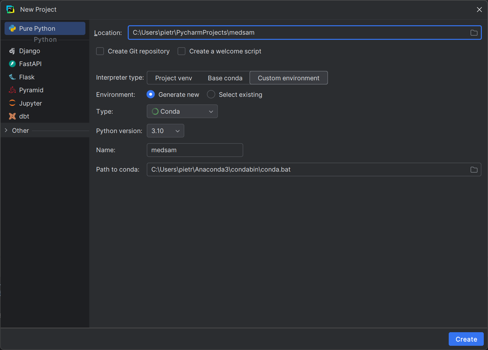
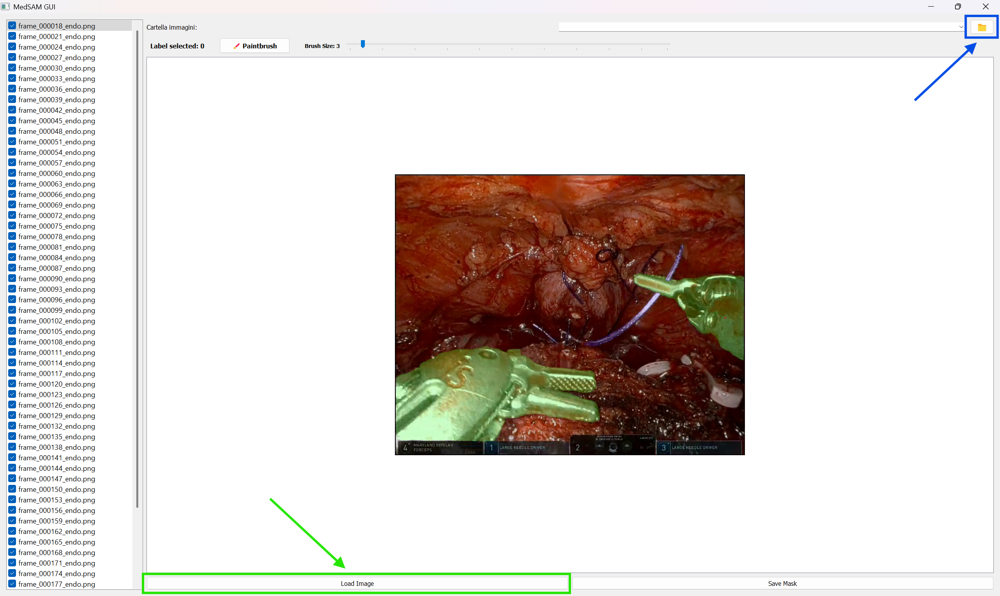
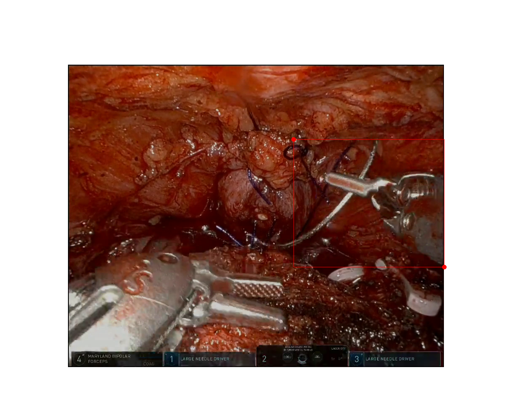
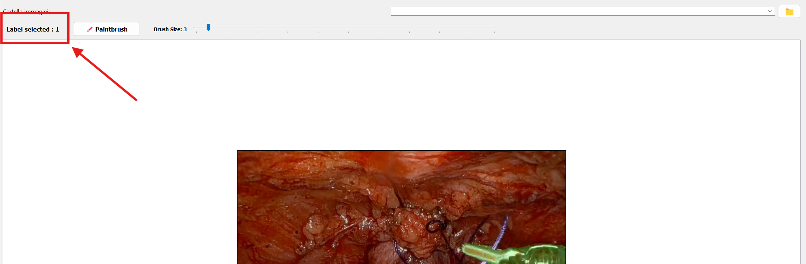
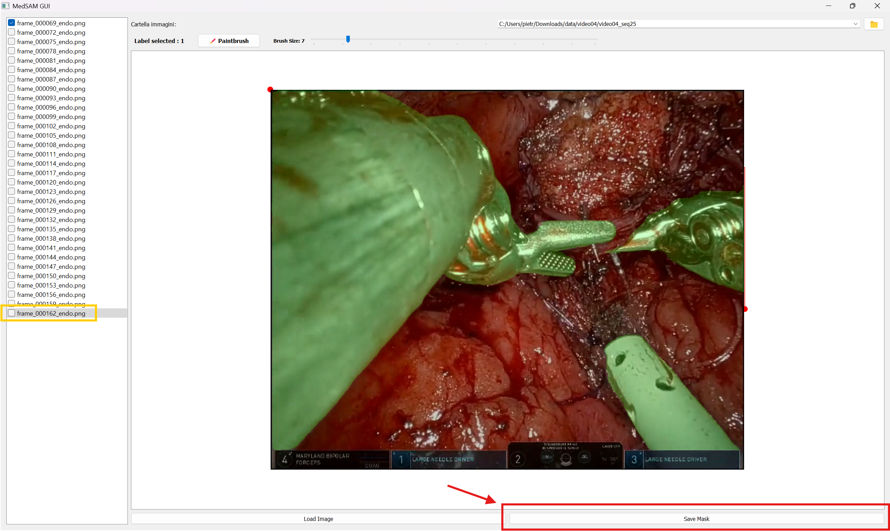
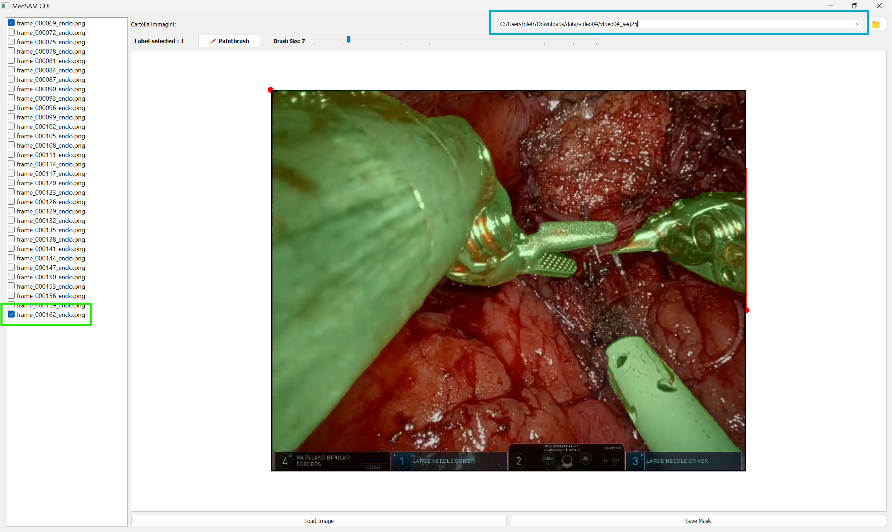
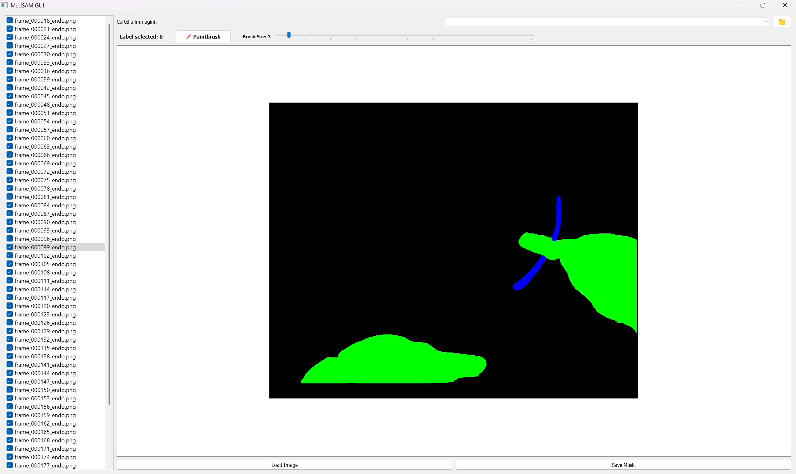

## Prerequisites

Before running the project, ensure the following software is installed:

### 1. [Anaconda](https://www.anaconda.com/products/distribution) **or** [Miniconda](https://docs.conda.io/en/latest/miniconda.html)

> **Anaconda** is a Python distribution that comes with many scientific libraries and tools.
> **Miniconda** is a lightweight version that includes only `conda`, allowing you to install only what you need.

🔗 Download and install one of the following:
- 🌐 Anaconda: https://www.anaconda.com/products/distribution **[Recommended]**
- 🌐 Miniconda: https://docs.conda.io/en/latest/miniconda.html

### 2. [PyCharm](https://www.jetbrains.com/pycharm/)

> PyCharm is a powerful Integrated Development Environment (IDE) designed for Python development, especially useful when working with Conda environments.

🔗 Download PyCharm here:
- 🌐 https://www.jetbrains.com/pycharm/download/

*The Community version is free and perfectly suitable for most Python projects.*  
*With the institutional emil `@studenti.poliba.it` you can get the Professional version for free.*

### 3. [Git Bash](https://git-scm.com/downloads) **or** [GitHub Desktop](https://desktop.github.com/)

> You'll need Git to clone the repository to your local machine.

🔗 Choose one of the following:  
- 🌐 Git Bash (command-line): https://git-scm.com/downloads  **[Recommended]**
- 🌐 GitHub Desktop (GUI): https://desktop.github.com/

## Installation
1. First of all, you have to create the environment and you can do this either via the Pycharm GUI or via console:  
   - Via console
   ```bash
      conda create -n medsam python=3.10 -y
      ```
   - Via Pycharm GUI:  
   New Project > Custom Environment
   
   
3. Activate the virtual environment created:
   ```bash 
   conda activate medsam
   ```
2. Install [Pythorch version >= 2.0](https://pytorch.org/get-started/previous-versions/) 
   - Is recommend downloading pytorch with `cuda` to use GPU instead of CPU  
   
   ```bash
   pip install torch==2.5.1 torchvision==0.20.1 torchaudio==2.5.1 --index-url https://download.pytorch.org/whl/cu118
   ```
3. Clone the original project of [MedSAM](https://github.com/bowang-lab/MedSAM)
   ```bash 
   git clone https://github.com/bowang-lab/MedSAM
   ```
4. Move to the MedSAM folder
    ```bash 
    cd MedSAM
    ```
6.  Install all the dependencies required
   ```bash
   pip install -e .
   ```

## Run `gui.py`
1. Download the [model checkpoint](https://drive.google.com/drive/folders/1ETWmi4AiniJeWOt6HAsYgTjYv_fkgzoN?usp=drive_link) and place it at `./work_dir/MedSAM/medsam_vit_b.pth`
2. Install `PyQt5`
   ```bash
   pip install PyQt5
   ```
3. Run `gui.py` or execute in console 
    ```bash
    python gui.py
    ```
## Run `gui_mod.py`
> If you managed to run and use `gui.py`, it will be very easy to run the improved version of the GUI
1. Place `gui_mod.py` in the same folder of `gui.py`
2. As for `gui.py` run the code `gui_mod.py` or execute in console
   ```bash
   python gui_mod.py 
   ```
## Guide
### Mouse Command
#### Load Image
> Image loading can be done:
   > - <span style="color: green;">Single Image</span> via the `Load Image` button.
   > - <span style="color: red;">Multiple Images</span> : All images contained in a selected folder via the button `📁` in the top right-hand corner.  
   Button `📁` opens an interactive dialogue box for folder selection.  
   > ⚠️ **WARNING** : Only images with the suffix `_endo.png` for the structure of previously saved images will be displayed.  
   > Double Click on the image file in the left window load the corrispodent image.
   
   > The check-box next to each image tells us whether the segmentation has already been carried out

#### Right Mouse Button
> The main tool here is the **bounding box** that you draw with the right mouse button over the area of interest, but there are additional commands to improve segmnetation.

> - Whereas in `gui.py` every time a new bounding box is created the label is changed, here you have the possibility of making multiple segmentations with the same label by selecting the label with the numbers `0` to `9`.  
The selected label can be seen in an indicator in the top left-hand corner

> - In this project, the segmentation labels are assigned as follows:
> - <p style="color: #1aff00;"> Surgical Instruments → 1</p>    
> - <p style="color: #0022ff;"> Needle → 2</p>
>   Please make sure that your training and annotation data follow this labeling convention.  
#### Left Mouse Button
> By clicking the right mouse button, you can use 2 tools:
- Paintbrush
- Eraser
> You must always select the label to use the paintbrush with the numbers, as mentioned above. 
To select <span style="color: red;">Paintbrush</span> or <span style="color: red;">Eraser</span>, there is a button in the top left-hand corner that indicates which tool is currently active.  
The size of the paintbrush (or eraser) can also be selected using the <span style="color: purple;">Slider</span> next to the brush or eraser selection button.  

#### Mouse Wheel

You can use your mouse scroll wheel to **Zoom in** and **Zoom out** on the image view.  

#### Save Segmentation
> To save the segmnetation, click the `Save Mask` button and an image will be saved in the same folder with the same name as the uploaded image with the suffix `_mask.png`.  
> ⚠️ **WARNING** The suffix `_mask.ong` is needed for the app to detect whether segmentation has taken place and tick the check-box. If you want to change how the app saves images, also change the check-box on segmented images. 

> Even if the mask is saved, the image selection window is not updated in real time. to update it, we must go to the bar indicating which directory we are in and click `Enter` (`Invio`).  
> Once this is done, a tick will appear next to the segmented image

> 

### Keybord Command

### `Ctrl+Z` → Undo Action

>You can press **`Ctrl + Z`** to undo the most recent segmentation action.  
>This is especially useful if a mask was added or modified by mistake.
> ⚠️ **WARNING**: When using the **paintbrush tool**, `Ctrl + Z` may not behave as expected.  
> This is because dragging the brush while holding the right mouse button to do the segmentation, generates a large number of intermediate masks.  
> The system can store only up to 10 actions in memory, so undoing may skip or partially revert recent brush strokes.

### `R` → Reset Segmentation
>Press the **`R`** key to **reset** the current segmentation.  
>This action will clear all mask data, allowing you to start over with a clean image.

### `M` → Mask-Only View
> Press the **`M`** key to toggle the **mask-only view** mode.  
> In this mode, the segmentation mask is displayed without transparency, making it easier to inspect the segmentation done to control if a hole or a random pixel is part of the segmentation


### `N` → Paintbrush/Eraser Selection
>Press the **`N`** key to toggle between **Paintbrush** and **Eraser** mode.  
⚠️ **WARNING**: Pressing the `N` key to toggle between Brush and Eraser does **not** update the state of the corresponding button in the GUI.  
> The visual status of the button will remain unchanged, even though the mode has switched.

## Video Example
This [video](https://politecnicobari-my.sharepoint.com/:v:/g/personal/p_marvulli_phd_poliba_it/Ea1ypb2TmbZNvhA-b7bw_pEBr1c6L-RpYQyBWPOYZDGQng?nav=eyJyZWZlcnJhbEluZm8iOnsicmVmZXJyYWxBcHAiOiJPbmVEcml2ZUZvckJ1c2luZXNzIiwicmVmZXJyYWxBcHBQbGF0Zm9ybSI6IldlYiIsInJlZmVycmFsTW9kZSI6InZpZXciLCJyZWZlcnJhbFZpZXciOiJNeUZpbGVzTGlua0NvcHkifX0&e=pL5pR2) show an example of segmentation using the GUI illustrated before.

## To-Do before running `gui_mod.py`
Before running the gui, there are any changes you need to make in the code to load the videos correctly without getting errors
> - Go to line 155 in the file `gui_mod.py` and enter a path to a folder containing the images to be segmented. Change the path `C:\Users\pietr\Downloads\data\video01_seq4` with an existing one on your pc with the images.
  ```python
  self.load_image_list_from_folder( r"C:\Users\pietr\Downloads\data\video01_seq4")
  ```
> - Go to line 212 in the file `gui_mod.py` and change the existing path `C:\Users\pietr\Downloads\data` to the path containing all video folders  
  ```python
  folder_path = QFileDialog.getExistingDirectory(
      self, "Seleziona una cartella con immagini", r"C:\Users\pietr\Downloads\data"
  )
  ```
**The GUI can be changed at will by adding (or removing) features by changing the various methods and the `Window` class**
